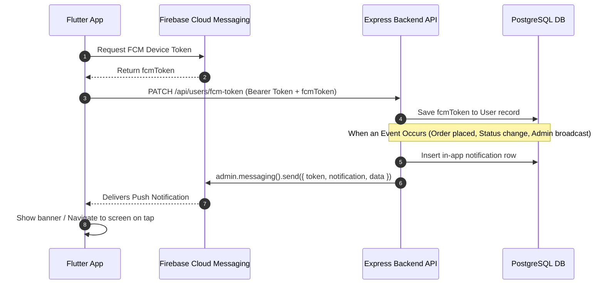

# 📱 Flutter Push & In-App Notifications Integration Guide

This guide provides everything the **Flutter Developer** needs to integrate **Firebase Cloud Messaging (FCM) Push Notifications** and the **In-App Notifications Inbox** with the Pasta E-Commerce Backend.

---

## 📋 1. Firebase Project Credentials

The backend and Flutter app connect to the following Firebase project:

| Parameter | Value |
|-----------|-------|
| **Project ID** | `bs6a-app` |
| **Sender ID (Project Number)** | `263444450427` |
| **KeyPair / VAPID Key** | `BOmCnnYnJPtkQ6ocxWlBzqIBV0ulLv4_wC_fz42qX6nYEGBHpXoLPsHKUbwxIoLwtmT4wKNjIw9Ah18fE7TAfOk` |
| **Storage Bucket** | `bs6a-app.firebasestorage.app` |
| **App ID (Web)** | `1:263444450427:web:6c3e95f122f11cbe14a6de` |
| **Measurement ID** | `G-C2MZB7KKGN` |
| **Service Account Email** | `firebase-adminsdk-fbsvc@bs6a-app.iam.gserviceaccount.com` |

---

## 📦 2. Flutter Dependencies

Add the required packages to your `pubspec.yaml`:

```yaml
dependencies:
  flutter:
    sdk: flutter
  firebase_core: ^3.12.0
  firebase_messaging: ^15.2.0
  flutter_local_notifications: ^18.0.1
  http: ^1.2.0 # or dio: ^5.7.0
```

Run:
```bash
flutter pub get
```

---

## ⚙️ 3. Platform Setup

### 🤖 Android Setup

1. Download your `google-services.json` from the Firebase Console (Project: `bs6a-app`) and place it under `android/app/google-services.json`.
2. In `android/build.gradle` (or `android/settings.gradle` in Flutter 3.16+):
   ```groovy
   buildscript {
       dependencies {
           classpath 'com.google.gms:google-services:4.4.2'
       }
   }
   ```
3. In `android/app/build.gradle`:
   ```groovy
   apply plugin: 'com.google.gms.google-services'
   ```
4. In `android/app/src/main/AndroidManifest.xml`:
   ```xml
   <manifest xmlns:android="http://schemas.android.com/apk/res/android">
       <!-- Required for Android 13+ (API level 33+) -->
       <uses-permission android:name="android.permission.POST_NOTIFICATIONS"/>
       <uses-permission android:name="android.permission.INTERNET"/>
       <uses-permission android:name="android.permission.VIBRATE" />

       <application ...>
           <!-- Notification Channel Metadata -->
           <meta-data
               android:name="com.google.firebase.messaging.default_notification_channel_id"
               android:value="high_importance_channel" />
       </application>
   </manifest>
   ```

### 🍏 iOS Setup

1. Download `GoogleService-Info.plist` from Firebase Console and add it to `ios/Runner/` via Xcode.
2. In Xcode under **Signing & Capabilities**:
   - Add **Push Notifications** capability.
   - Add **Background Modes** capability and check:
     - `Remote notifications`
     - `Background fetch`
3. In `ios/Runner/Info.plist`:
   ```xml
   <key>UIBackgroundModes</key>
   <array>
       <string>fetch</string>
       <string>remote-notification</string>
   </array>
   ```

---

## 🔄 4. How the Notification Flow Works



---

## 🛠️ 5. Complete Flutter Implementation (`NotificationService`)

Create `lib/services/notification_service.dart`:

```dart
import 'dart:convert';
import 'dart:io';
import 'package:firebase_core/firebase_core.dart';
import 'package:firebase_messaging/firebase_messaging.dart';
import 'package:flutter/material.dart';
import 'package:flutter_local_notifications/flutter_local_notifications.dart';
import 'package:http/http.dart' as http;

// Top-level background message handler (must be outside any class)
@pragma('vm:entry-point')
Future<void> firebaseMessagingBackgroundHandler(RemoteMessage message) async {
  await Firebase.initializeApp();
  print('🔔 Background message received: ${message.messageId}');
}

class NotificationService {
  NotificationService._internal();
  static final NotificationService instance = NotificationService._internal();

  final FirebaseMessaging _fcm = FirebaseMessaging.instance;
  final FlutterLocalNotificationsPlugin _localNotifications = FlutterLocalNotificationsPlugin();

  static const AndroidNotificationChannel _channel = AndroidNotificationChannel(
    'high_importance_channel', // id matching AndroidManifest.xml
    'High Importance Notifications', // title
    description: 'This channel is used for important marketplace notifications.',
    importance: Importance.high,
    playSound: true,
  );

  GlobalKey<NavigatorState>? navigatorKey;

  /// Call this in your main.dart during app initialization
  Future<void> initialize({GlobalKey<NavigatorState>? navKey}) async {
    navigatorKey = navKey;

    // 1. Request permissions (especially required for iOS and Android 13+)
    NotificationSettings settings = await _fcm.requestPermission(
      alert: true,
      badge: true,
      sound: true,
      provisional: false,
    );

    if (settings.authorizationStatus == AuthorizationStatus.authorized) {
      print('✅ Notification permissions granted');
    }

    // 2. Setup Android notification channel
    await _localNotifications
        .resolvePlatformSpecificImplementation<AndroidFlutterLocalNotificationsPlugin>()
        ?.createNotificationChannel(_channel);

    // 3. Initialize flutter_local_notifications for foreground display
    const AndroidInitializationSettings androidSettings = AndroidInitializationSettings('@mipmap/ic_launcher');
    const DarwinInitializationSettings iosSettings = DarwinInitializationSettings(
      requestAlertPermission: true,
      requestBadgePermission: true,
      requestSoundPermission: true,
    );

    const InitializationSettings initSettings = InitializationSettings(
      android: androidSettings,
      iOS: iosSettings,
    );

    await _localNotifications.initialize(
      initSettings,
      onDidReceiveNotificationResponse: (NotificationResponse response) {
        if (response.payload != null && response.payload!.isNotEmpty) {
          final Map<String, dynamic> data = jsonDecode(response.payload!);
          handleNotificationTap(data);
        }
      },
    );

    // 4. Foreground message listener
    FirebaseMessaging.onMessage.listen((RemoteMessage message) {
      print('📬 Foreground message received: ${message.notification?.title}');
      _showLocalNotification(message);
    });

    // 5. App opened from background state (by tapping notification)
    FirebaseMessaging.onMessageOpenedApp.listen((RemoteMessage message) {
      print('🚀 App opened from notification tap (background): ${message.data}');
      handleNotificationTap(message.data);
    });

    // 6. App launched from completely terminated state
    RemoteMessage? initialMessage = await _fcm.getInitialMessage();
    if (initialMessage != null) {
      print('⚡ App launched from terminated state: ${initialMessage.data}');
      handleNotificationTap(initialMessage.data);
    }

    // 7. Listen for token refreshes
    _fcm.onTokenRefresh.listen((newToken) {
      print('🔄 FCM Token refreshed: $newToken');
      // Pass the current user JWT token to sync with backend
      syncTokenWithBackend(newToken);
    });
  }

  /// Display a heads-up notification banner when the app is in the FOREGROUND
  Future<void> _showLocalNotification(RemoteMessage message) async {
    RemoteNotification? notification = message.notification;
    AndroidNotification? android = message.notification?.android;

    if (notification != null) {
      await _localNotifications.show(
        notification.hashCode,
        notification.title,
        notification.body,
        NotificationDetails(
          android: AndroidNotificationDetails(
            _channel.id,
            _channel.name,
            channelDescription: _channel.description,
            icon: android?.smallIcon ?? '@mipmap/ic_launcher',
            importance: Importance.high,
            priority: Priority.high,
            playSound: true,
          ),
          iOS: const DarwinNotificationDetails(
            presentAlert: true,
            presentBadge: true,
            presentSound: true,
          ),
        ),
        payload: jsonEncode(message.data),
      );
    }
  }

  /// Fetch FCM Token and sync with Backend
  Future<String?> getAndSyncDeviceToken(String authToken, {String baseUrl = 'https://bs6a.com/api'}) async {
    try {
      String? fcmToken = await _fcm.getToken();
      if (fcmToken != null) {
        print('🔑 FCM Device Token: $fcmToken');
        await sendTokenToBackend(fcmToken, authToken: authToken, baseUrl: baseUrl);
      }
      return fcmToken;
    } catch (e) {
      print('❌ Failed to get FCM token: $e');
      return null;
    }
  }

  /// Register or update FCM Token in Backend DB
  Future<bool> sendTokenToBackend(String fcmToken, {required String authToken, String baseUrl = 'https://bs6a.com/api'}) async {
    try {
      final response = await http.patch(
        Uri.parse('$baseUrl/users/fcm-token'),
        headers: {
          'Content-Type': 'application/json',
          'Authorization': 'Bearer $authToken',
        },
        body: jsonEncode({'token': fcmToken}),
      );

      if (response.statusCode == 200) {
        print('✅ FCM Token synced with backend');
        return true;
      } else {
        print('❌ Backend token sync failed: ${response.statusCode} - ${response.body}');
        return false;
      }
    } catch (e) {
      print('❌ Network error syncing FCM token: $e');
      return false;
    }
  }

  void syncTokenWithBackend(String newToken) {
    // Implement token sync with your Auth state management / secure storage
  }

  /// Handle Notification Navigation on Tap
  void handleNotificationTap(Map<String, dynamic> data) {
    final String? path = data['path'];
    final String? type = data['type'];

    print('🧭 Navigating from notification -> Type: $type, Path: $path');

    if (navigatorKey?.currentState == null || path == null) return;

    // Route Dispatcher:
    if (type == 'ORDER' || path.startsWith('/orders/')) {
      // Navigate to order details screen
      navigatorKey!.currentState!.pushNamed(path);
    } else if (type == 'STORE' || path.startsWith('/vendor/')) {
      // Navigate to vendor/store screen
      navigatorKey!.currentState!.pushNamed(path);
    } else {
      // Default: Navigate to Notifications Inbox
      navigatorKey!.currentState!.pushNamed('/notifications');
    }
  }
}
```

---

## 🚀 6. Integration in `main.dart`

```dart
import 'package:flutter/material.dart';
import 'package:firebase_core/firebase_core.dart';
import 'package:firebase_messaging/firebase_messaging.dart';
import 'services/notification_service.dart';

final GlobalKey<NavigatorState> navigatorKey = GlobalKey<NavigatorState>();

void main() async {
  WidgetsFlutterBinding.ensureInitialized();
  
  // 1. Initialize Firebase
  await Firebase.initializeApp();

  // 2. Set background messaging handler
  FirebaseMessaging.onBackgroundMessage(firebaseMessagingBackgroundHandler);

  // 3. Initialize Notification Service
  await NotificationService.instance.initialize(navKey: navigatorKey);

  runApp(const MyApp());
}

class MyApp extends StatelessWidget {
  const MyApp({super.key});

  @override
  Widget build(BuildContext context) {
    return MaterialApp(
      navigatorKey: navigatorKey,
      title: 'Pasta E-Commerce',
      theme: ThemeData(primarySwatch: Colors.orange),
      initialRoute: '/',
      routes: {
        '/': (context) => const HomeScreen(),
        '/notifications': (context) => const NotificationsScreen(),
        // Add other deep-link routes
      },
    );
  }
}

class HomeScreen extends StatelessWidget {
  const HomeScreen({super.key});

  @override
  Widget build(BuildContext context) {
    return Scaffold(
      appBar: AppBar(title: const Text('Pasta E-Commerce')),
      body: const Center(child: Text('Welcome!')),
    );
  }
}

class NotificationsScreen extends StatelessWidget {
  const NotificationsScreen({super.key});

  @override
  Widget build(BuildContext context) {
    return Scaffold(
      appBar: AppBar(title: const Text('Notifications')),
      body: const Center(child: Text('Notification Inbox')),
    );
  }
}
```

---

## 📡 7. Backend Notification API Reference

Base URL: `https://bs6a.com/api` (or `http://localhost:3000/api`)

### 1. Register/Update FCM Device Token
Call this whenever a user logs in, registers, or when the token refreshes.

- **Endpoint:** `PATCH /api/users/fcm-token`
- **Headers:** `Authorization: Bearer <JWT_TOKEN>`
- **Body:**
  ```json
  {
    "token": "eXamPle_fcm_dEviCe_tOkEn_sTriNg..."
  }
  ```
- **Response `200 OK`:**
  ```json
  {
    "status": "success",
    "data": {
      "message": "Device token registered successfully"
    }
  }
  ```

---

### 2. Social Login with FCM Token
If using Firebase Social Login, pass `fcmToken` directly in the payload:

- **Endpoint:** `POST /api/users/social-login`
- **Body:**
  ```json
  {
    "idToken": "<FIREBASE_ID_TOKEN>",
    "role": "CUSTOMER",
    "fcmToken": "<FCM_DEVICE_TOKEN>"
  }
  ```

---

### 3. Get In-App Notifications Inbox
Fetch user notifications (newest first).

- **Endpoint:** `GET /api/notifications?page=1&limit=15`
- **Headers:** `Authorization: Bearer <JWT_TOKEN>`
- **Response `200 OK`:**
  ```json
  {
    "status": "success",
    "data": [
      {
        "id": "e93240e4-54c3-42e1-a20d-83b3793798cf",
        "type": "ORDER",
        "title": "Order Shipped! 🚚",
        "message": "Your order #1042 has been shipped. Tracking: TRK123456",
        "link": "/orders/e93240e4-54c3-42e1-a20d-83b3793798cf",
        "isRead": false,
        "createdAt": "2026-08-06T14:30:00.000Z"
      }
    ]
  }
  ```

---

### 4. Get Unread Notification Count (Bell Badge)
Retrieve the number of unread notifications to display on the Bell icon badge.

- **Endpoint:** `GET /api/notifications/unread-count`
- **Headers:** `Authorization: Bearer <JWT_TOKEN>`
- **Response `200 OK`:**
  ```json
  {
    "status": "success",
    "data": {
      "unreadCount": 3
    }
  }
  ```

---

### 5. Mark Notification as Read
- **Endpoint:** `PATCH /api/notifications/:id/read`
- **Headers:** `Authorization: Bearer <JWT_TOKEN>`
- **Response `200 OK`:**
  ```json
  {
    "status": "success",
    "data": {
      "id": "e93240e4-54c3-42e1-a20d-83b3793798cf",
      "isRead": true
    }
  }
  ```

---

## 📬 8. FCM Payload Structure Sent by Backend

When the backend sends a push notification, it delivers both a `notification` and a `data` block:

```json
{
  "notification": {
    "title": "Order Shipped! 🚚",
    "body": "Your order #1042 has been shipped."
  },
  "data": {
    "click_action": "FLUTTER_NOTIFICATION_CLICK",
    "path": "/orders/e93240e4-54c3-42e1-a20d-83b3793798cf",
    "type": "ORDER"
  }
}
```

### Event Notification Types:

| Notification Type | Trigger Event | Destination Path |
|-------------------|---------------|------------------|
| `ORDER` | Order placed, status updated (Processing, Shipped, Delivered, Cancelled) | `/orders/:orderId` |
| `STORE` | Store approved / rejected | `/vendor/store` |
| `SYSTEM` | Subscription approval / expiry warning, Broadcast announcements | `/vendor/subscriptions` or custom link |
| `PROMOTION` | New discounts, marketing campaigns | `/products` or custom promotion link |

---

## 🧪 9. Testing & Troubleshooting

1. **Verify Token Registration:**
   - Log in on the Flutter app.
   - Inspect the backend database or debug output to confirm the `users.fcmToken` column is populated.
2. **Test Push from Firebase Console:**
   - Go to Firebase Console -> **Cloud Messaging** -> **New Campaign** -> Send test message to device token.
3. **Test Push from Backend Admin:**
   - Use `POST /api/notifications/admin/send` with `{ "title": "Test", "message": "Testing FCM", "targetAudience": "ALL" }`.
   - Both Android and iOS devices registered will receive the push notification instantly.
