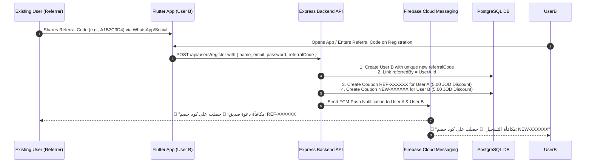

# 🎁 Flutter Referral & Invitation System Integration Guide

This guide explains how the **Referral Code & Invitation System** works in Pasta E-Commerce, along with complete Dart code, API specs, UI screens, deep linking, and push notification flows for the **Flutter Developer**.

---

## 📌 1. System Overview & Reward Flow



### 🏆 Reward Rules:
1. **Unique Code per User**: Every user automatically gets a unique 8-character uppercase referral code upon registration (e.g. `A1B2C3D4`).
2. **Two-Way Reward**: When a new user registers with a friend's code:
   - **Referrer** receives a fixed discount coupon (e.g. `REF-XXXXXX`, 5.00 JOD, valid for 30 days, single use).
   - **New User** receives a welcome discount coupon (e.g. `NEW-XXXXXX`, 5.00 JOD, valid for 30 days, single use).
3. **Instant FCM Push**: Both users instantly receive push notifications with their coupon code.

---

## 📡 2. Backend API Specifications

### A. Register New Account (With Referral Code)
When a user fills the registration form, include the optional `referralCode`:

- **Endpoint:** `POST /api/users/register`
- **Headers:** `Content-Type: application/json`
- **Request Body:**
```json
{
  "name": "Ahmad Khalil",
  "email": "ahmad@example.com",
  "password": "password123",
  "phone": "+962791234567",
  "role": "CUSTOMER",
  "referralCode": "A1B2C3D4"
}
```
- **Response `201 Created`:**
```json
{
  "status": "success",
  "message": "User registered successfully. Please check your email to activate your account."
}
```

---

### B. User Login & Profile (Accessing User's Referral Code)
The user's own `referralCode` is returned in the `user` object upon login and social login.

- **Endpoint:** `POST /api/users/login`
- **Request Body:**
```json
{
  "email": "ahmad@example.com",
  "password": "password123"
}
```
- **Response `200 OK`:**
```json
{
  "status": "success",
  "token": "eyJhbGciOiJIUzI1NiIsInR5cCI6IkpXVCJ9...",
  "user": {
    "id": "c847e11f-508b-4c28-98e6-e17f04123456",
    "name": "Ahmad Khalil",
    "email": "ahmad@example.com",
    "role": "CUSTOMER",
    "status": "ACTIVE",
    "referralCode": "E5F6G7H8"
  }
}
```

> [!NOTE]
> Save `user.referralCode` in your Local Storage / Secure Storage / Auth State (e.g., `SharedPreferences`, `flutter_secure_storage`, Riverpod, or Bloc).

---

### C. Applying the Referral Reward Coupon at Checkout
Users can apply their reward coupon (`REF-XXXXXX` or `NEW-XXXXXX`) in Cart or Checkout:

- **Endpoint:** `POST /api/carts/apply-coupon`
- **Headers:** `Authorization: Bearer <JWT_TOKEN>`
- **Request Body:**
```json
{
  "code": "REF-A1B2C3"
}
```
- **Response `200 OK`:**
```json
{
  "status": "success",
  "data": {
    "cartTotal": 35.00,
    "discountAmount": 5.00,
    "finalTotal": 30.00,
    "appliedCoupon": {
      "code": "REF-A1B2C3",
      "type": "FIXED",
      "value": "5.00"
    }
  }
}
```

---

## 📦 3. Required Flutter Packages

Add the following to your `pubspec.yaml`:

```yaml
dependencies:
  flutter:
    sdk: flutter
  share_plus: ^10.1.2       # For sharing referral links & codes
  flutter_toast: ^8.2.8     # (or your custom snackbar)
  http: ^1.2.2              # (or dio: ^5.7.0)
  app_links: ^6.3.2         # For handling deep links (https://bs6a.com/register?ref=...)
```

Run:
```bash
flutter pub get
```

---

## 📱 4. Flutter UI: "Invite Friends & Earn" Screen

Create `lib/screens/referral_invite_screen.dart`:

```dart
import 'package:flutter/material.dart';
import 'package:flutter/services.dart';
import 'package:share_plus/share_plus.dart';

class ReferralInviteScreen extends StatelessWidget {
  final String referralCode;
  final String userName;

  const ReferralInviteScreen({
    super.key,
    required this.referralCode,
    this.userName = 'صديقك',
  });

  // App domain for web / deep link fallback
  static const String appDownloadUrl = 'https://bs6a.com/register';

  String get shareMessage =>
      '🍕 مرحباً! استخدم رمز الدعوة الخاص بي ($referralCode) عند التسجيل في تطبيق باسطا واحصل على خصم 5 د.أ على طلبك القادم!\n\nرابط التسجيل: $appDownloadUrl?ref=$referralCode';

  void _copyToClipboard(BuildContext context) {
    Clipboard.setData(ClipboardData(text: referralCode));
    ScaffoldMessenger.of(context).showSnackBar(
      const SnackBar(
        content: Text('تم نسخ رمز الدعوة بنجاح! 📋'),
        backgroundColor: Colors.green,
        duration: Duration(seconds: 2),
      ),
    );
  }

  void _shareInvite() {
    Share.share(
      shareMessage,
      subject: 'دعوة للانضمام إلى تطبيق باسطا 🍝',
    );
  }

  @override
  Widget build(BuildContext context) {
    return Scaffold(
      backgroundColor: const Color(0xFFF8F9FA),
      appBar: AppBar(
        title: const Text('دعوة الأصدقاء والمكافآت', style: TextStyle(fontWeight: FontWeight.bold)),
        centerTitle: true,
        elevation: 0,
        backgroundColor: Colors.white,
        foregroundColor: Colors.black87,
      ),
      body: SingleChildScrollView(
        padding: const EdgeInsets.all(20.0),
        child: Column(
          crossAxisAlignment: CrossAxisAlignment.center,
          children: [
            const SizedBox(height: 10),
            // Hero Icon / Illustration
            Container(
              padding: const EdgeInsets.all(24),
              decoration: BoxDecoration(
                color: Colors.orange.shade50,
                shape: BoxShape.circle,
              ),
              child: Icon(Icons.card_giftcard_rounded, size: 72, color: Colors.orange.shade700),
            ),
            const SizedBox(height: 20),

            // Title & Description
            const Text(
              'ادعُ أصدقاءك واكسب 5 د.أ! 🎉',
              textAlign: TextAlign.center,
              style: TextStyle(fontSize: 22, fontWeight: FontWeight.bold, color: Colors.black87),
            ),
            const SizedBox(height: 8),
            Text(
              'شارك رمز الدعوة مع أصدقائك. عند تسجيلهم، ستحصل أنت وصديقك على قسيمة خصم بقيمة 5 د.أ فوراً!',
              textAlign: TextAlign.center,
              style: TextStyle(fontSize: 14, color: Colors.grey.shade700, height: 1.5),
            ),
            const SizedBox(height: 30),

            // Referral Code Box
            Container(
              padding: const EdgeInsets.symmetric(horizontal: 20, vertical: 16),
              decoration: BoxDecoration(
                color: Colors.white,
                borderRadius: BorderRadius.circular(16),
                border: Border.all(color: Colors.orange.shade200, width: 1.5),
                boxShadow: [
                  BoxShadow(
                    color: Colors.orange.shade500.withOpacity(0.08),
                    blurRadius: 15,
                    offset: const Offset(0, 5),
                  ),
                ],
              ),
              child: Row(
                mainAxisAlignment: MainAxisAlignment.spaceBetween,
                children: [
                  Column(
                    crossAxisAlignment: CrossAxisAlignment.start,
                    children: [
                      Text(
                        'رمز الدعوة الخاص بك',
                        style: TextStyle(fontSize: 12, color: Colors.grey.shade600),
                      ),
                      const SizedBox(height: 4),
                      Text(
                        referralCode,
                        style: TextStyle(
                          fontSize: 24,
                          fontWeight: FontWeight.w900,
                          letterSpacing: 3,
                          color: Colors.orange.shade800,
                        ),
                      ),
                    ],
                  ),
                  ElevatedButton.icon(
                    onPressed: () => _copyToClipboard(context),
                    icon: const Icon(Icons.copy_rounded, size: 18),
                    label: const Text('نسخ'),
                    style: ElevatedButton.styleFrom(
                      backgroundColor: Colors.orange.shade600,
                      foregroundColor: Colors.white,
                      elevation: 0,
                      shape: RoundedRectangleBorder(borderRadius: BorderRadius.circular(10)),
                    ),
                  ),
                ],
              ),
            ),
            const SizedBox(height: 20),

            // Share Button
            SizedBox(
              width: double.infinity,
              height: 52,
              child: ElevatedButton.icon(
                onPressed: _shareInvite,
                icon: const Icon(Icons.share_rounded),
                label: const Text('مشاركة رابط الدعوة', style: TextStyle(fontSize: 16, fontWeight: FontWeight.bold)),
                style: ElevatedButton.styleFrom(
                  backgroundColor: const Color(0xFFE65100),
                  foregroundColor: Colors.white,
                  shape: RoundedRectangleBorder(borderRadius: BorderRadius.circular(14)),
                  elevation: 2,
                ),
              ),
            ),
            const SizedBox(height: 40),

            // How It Works Steps
            Align(
              alignment: Alignment.centerRight,
              child: Text(
                'كيف تعمل المكافآت؟',
                style: TextStyle(fontSize: 16, fontWeight: FontWeight.bold, color: Colors.grey.shade800),
              ),
            ),
            const SizedBox(height: 16),

            _buildStepTile(
              stepNumber: '1',
              title: 'شارك الرمز',
              description: 'أرسل رمز الدعوة أو الرابط إلى أصدقائك عبر وسائل التواصل.',
              icon: Icons.send_rounded,
            ),
            _buildStepTile(
              stepNumber: '2',
              title: 'صديقك يسجل',
              description: 'يقوم صديقك بإنشاء حساب جديد وإدخال رمزك في حقل رمز الدعوة.',
              icon: Icons.person_add_alt_1_rounded,
            ),
            _buildStepTile(
              stepNumber: '3',
              title: 'كلاكما يربح!',
              description: 'تحصل فوراً على إشعار وقسيمة خصم بقيمة 5 د.أ ويحصل صديقك على قسيمة مماثلة.',
              icon: Icons.celebration_rounded,
              isLast: true,
            ),
          ],
        ),
      ),
    );
  }

  Widget _buildStepTile({
    required String stepNumber,
    required String title,
    required String description,
    required IconData icon,
    bool isLast = false,
  }) {
    return Row(
      crossAxisAlignment: CrossAxisAlignment.start,
      children: [
        Column(
          children: [
            Container(
              width: 36,
              height: 36,
              decoration: BoxDecoration(
                color: Colors.orange.shade100,
                shape: BoxShape.circle,
              ),
              child: Center(
                child: Text(
                  stepNumber,
                  style: TextStyle(fontWeight: FontWeight.bold, color: Colors.orange.shade900),
                ),
              ),
            ),
            if (!isLast)
              Container(
                width: 2,
                height: 35,
                color: Colors.orange.shade200,
                margin: const EdgeInsets.symmetric(vertical: 4),
              ),
          ],
        ),
        const SizedBox(width: 14),
        Expanded(
          child: Column(
            crossAxisAlignment: CrossAxisAlignment.start,
            children: [
              Text(title, style: const TextStyle(fontWeight: FontWeight.bold, fontSize: 15, color: Colors.black87)),
              const SizedBox(height: 4),
              Text(description, style: TextStyle(fontSize: 13, color: Colors.grey.shade600, height: 1.4)),
              const SizedBox(height: 16),
            ],
          ),
        ),
      ],
    );
  }
}
```

---

## 📝 5. Registration Screen Integration (Referral Code Field)

In your Registration Form (`lib/screens/register_screen.dart`), add the `referralCode` input field:

```dart
final TextEditingController _nameController = TextEditingController();
final TextEditingController _emailController = TextEditingController();
final TextEditingController _passwordController = TextEditingController();
final TextEditingController _phoneController = TextEditingController();
final TextEditingController _referralCodeController = TextEditingController();

// Optional: auto-fill from deep link on init
@override
void initState() {
  super.initState();
  if (widget.initialReferralCode != null) {
    _referralCodeController.text = widget.initialReferralCode!;
  }
}

// Widget UI:
TextFormField(
  controller: _referralCodeController,
  textCapitalization: TextCapitalization.characters,
  decoration: InputDecoration(
    labelText: 'رمز الدعوة (اختياري)',
    hintText: 'مثال: A1B2C3D4',
    prefixIcon: const Icon(Icons.card_giftcard_rounded, color: Colors.orange),
    border: OutlineInputBorder(borderRadius: BorderRadius.circular(12)),
    filled: true,
    fillColor: Colors.white,
    helperText: 'أدخل رمز الدعوة للحصول على قسيمة خصم ترحيبية!',
  ),
);

// Submit Method:
Future<void> _handleRegister() async {
  final body = {
    "name": _nameController.text.trim(),
    "email": _emailController.text.trim(),
    "password": _passwordController.text,
    "phone": _phoneController.text.trim(),
    "role": "CUSTOMER",
    if (_referralCodeController.text.trim().isNotEmpty)
      "referralCode": _referralCodeController.text.trim().toUpperCase(),
  };

  final response = await http.post(
    Uri.parse('https://bs6a.com/api/users/register'),
    headers: {'Content-Type': 'application/json'},
    body: jsonEncode(body),
  );

  if (response.statusCode == 201) {
    // Navigate to email confirmation screen
  }
}
```

---

## 🔗 6. Deep Linking / App Links Integration

When someone clicks an invite link (e.g. `https://bs6a.com/register?ref=A1B2C3D4`), the app can automatically open the Registration Screen with the referral code pre-filled!

### Using `app_links`:

```dart
import 'package:app_links/app_links.dart';

class DeepLinkHandler {
  static final AppLinks _appLinks = AppLinks();

  static void initialize(GlobalKey<NavigatorState> navigatorKey) {
    // Listen to incoming links while app is running
    _appLinks.uriLinkStream.listen((Uri? uri) {
      if (uri != null) {
        _handleUri(uri, navigatorKey);
      }
    });
  }

  static void _handleUri(Uri uri, GlobalKey<NavigatorState> navigatorKey) {
    // URL Pattern: https://bs6a.com/register?ref=A1B2C3D4
    if (uri.path == '/register' || uri.queryParameters.containsKey('ref')) {
      final String? refCode = uri.queryParameters['ref'];
      if (refCode != null && refCode.isNotEmpty) {
        navigatorKey.currentState?.pushNamed(
          '/register',
          arguments: {'referralCode': refCode.toUpperCase()},
        );
      }
    }
  }
}
```

---

## 🔔 7. Push Notification Handling for Referral Rewards

When a referral succeeds, the backend triggers an FCM push notification with payload:

```json
{
  "notification": {
    "title": "مكافأة دعوة صديق! 🎉",
    "body": "صديقك أحمد سجل باستخدام الرمز الخاص بك! لقد حصلت على قسيمة خصم بقيمة 50. الكود: REF-A1B2C3"
  },
  "data": {
    "click_action": "FLUTTER_NOTIFICATION_CLICK",
    "type": "PROMOTION",
    "path": "/notifications"
  }
}
```

When tapped, your `NotificationService` routes the user to the Notifications Screen where they can view the coupon code and apply it during checkout.

---

## 🧪 8. Testing & QA Checklist

- [ ] **Step 1:** Log in with User A -> Navigate to "Invite Friends" screen -> Verify `referralCode` is displayed correctly.
- [ ] **Step 2:** Click "Copy" -> Verify clipboard receives the exact code.
- [ ] **Step 3:** Click "Share" -> Verify the share sheet opens with the invite message and link.
- [ ] **Step 4:** Open Register Screen with User B -> Enter User A's referral code -> Complete registration.
- [ ] **Step 5:** Verify User A & User B receive FCM push notifications with their respective coupon codes (`REF-XXXXXX` and `NEW-XXXXXX`).
- [ ] **Step 6:** Add products to cart -> Apply the coupon -> Verify the 5.00 JOD discount is applied.
